<p align="center">
  <picture>
    <source media="(prefers-color-scheme: dark)" srcset="./assets/brand/logo-dark.svg">
    <source media="(prefers-color-scheme: light)" srcset="./assets/brand/logo-light.svg">
    
  </picture>
</p>

<p align="center"><strong>Turn a useful workflow into a personal ChatGPT prompt pack or a full, reviewable plugin package.</strong></p>

<p align="center">
  <a href="https://github.com/AgentMindCloud/ChatGPT_Universal_Spawn/actions/workflows/ci.yml"></a>
  <a href="https://www.npmjs.com/package/@agentmindcloud/chatgpt-spawn"></a>
  <a href="./LICENSE"></a>
  
  <a href="./compat/openai-docs.lock.json"></a>
</p>

> [!IMPORTANT]
> ChatGPT Universal Spawn is an independent AgentMindCloud project. It is not an OpenAI product and is not endorsed by OpenAI. It does not reuse the OpenAI logo or knot mark.

## What this does

ChatGPT plugins can combine three building blocks:

- A **skill** tells ChatGPT when and how to perform a repeatable workflow.
- An **MCP server** gives ChatGPT callable tools, such as searching an approved database or creating a project item.
- An **MCP Apps UI** adds an interactive interface to an MCP-backed tool.

This toolkit creates the right folder, checks it for broken paths and risky files, and supports two practical routes. **Personal mode** exports a copy-and-paste ChatGPT prompt that needs no workspace, app ID, API key, server, or plugin installation. **Developer mode** builds reproducible plugin ZIPs, previews marketplace changes, links registered MCP apps, and exports manual Custom GPT artifacts.

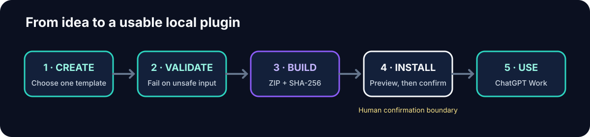

The normal workflow never writes outside the directory you select. Only `install` writes to a marketplace, and it always prints the full plan first. Interactive installation asks for confirmation; automation must pass `--yes`.

## Supported surfaces

| Surface | v1 status | What that means |
| --- | --- | --- |
| Normal ChatGPT conversation | Supported through personal export | A skills-only project becomes a self-contained prompt pack that the user copies into a chat. No app registration or API key. |
| ChatGPT custom instructions | Manual prompt use | The personal prompt can be copied into custom instructions when it fits the account's current limits. |
| ChatGPT Work on the web | Supported | Uses the official plugin package built around `.codex-plugin/plugin.json`. |
| ChatGPT desktop Work mode | Supported | Uses the same package and registered MCP app identity where required. |
| Shared ChatGPT/Codex plugin directory | Supported | A single plugin package can be used by the supported ChatGPT Work and Codex plugin flows. |
| Personal marketplace | Supported | Installs under the default `~/.agents/plugins/marketplace.json` marketplace. |
| Repository marketplace | Supported | Installs under `<repo>/.agents/plugins/marketplace.json` only when explicitly selected. |
| Custom GPT editor | Export only | Produces instructions, knowledge, OpenAPI actions, starters, checksums, and a manual checklist. |
| Mobile-only plugin management or unsupported IDE surfaces | Not claimed | The personal prompt remains usable as text, but v1 does not claim plugin installation where that surface is unavailable. |
| Automatic GPT creation or Store publishing | Not supported | No documented creation API is assumed; publication remains a human action. |

The implementation follows the first-party [plugin architecture](https://developers.openai.com/plugins/concepts/plugins), [plugin packaging](https://developers.openai.com/plugins/build/plugins), [supported ChatGPT surfaces](https://learn.chatgpt.com/docs/plugins), [submission checklist](https://developers.openai.com/plugins/deploy/submission#final-checklist), and [GPT Actions](https://developers.openai.com/api/docs/actions/introduction) documentation.

## Choose your path

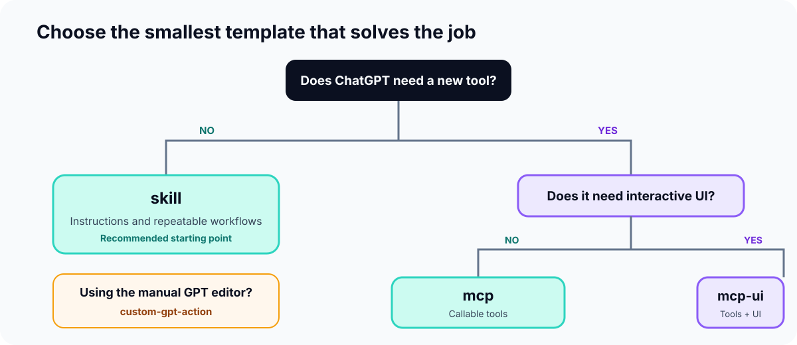

### I have a normal ChatGPT account

Choose the skills-only template, then export a portable prompt pack:

```powershell
node .\dist\cli.js export personal-chat .\meeting-follow-up --out .\meeting-follow-up-chat
```

Open `meeting-follow-up-chat/START-HERE.md`. Copy `CHATGPT-PROMPT.md` into a normal conversation, then provide your meeting notes. This route does not install anything and requires no workspace, app ID, API key, MCP server, or marketplace.

### I want ChatGPT to guide me conversationally

Build the project and export the self-hosting companion as a normal-chat prompt:

```powershell
npm ci
npm run build
node .\dist\cli.js export personal-chat .\plugin\chatgpt-universal-spawn --out .\chatgpt-spawn-companion
```

Paste `chatgpt-spawn-companion/CHATGPT-PROMPT.md` into a normal conversation, then ask: `Help me choose and create the right ChatGPT workflow.` This requires no registration or installation.

If your client exposes a supported plugin marketplace, you can instead preview and install the full companion:

```powershell
node .\dist\cli.js install .\plugin\chatgpt-universal-spawn --marketplace personal --dry-run
node .\dist\cli.js install .\plugin\chatgpt-universal-spawn --marketplace personal
```

After the preview matches your expectation and you confirm it, activate the marketplace entry with the plugin control exposed by your ChatGPT Work or Codex client. For the Codex CLI, use:

```powershell
codex plugin add chatgpt-universal-spawn@personal
```

Then ask: `Help me choose and create the right ChatGPT plugin template.`

### I want the fastest CLI route

Use the skills-only `meeting-follow-up` tutorial in the five-minute quickstart below.

### I am building MCP tools or UI

Start with `mcp` for tools only. Choose `mcp-ui` only when an interactive view materially improves the task. The credential-free [`project-launch-planner`](./examples/project-launch-planner/README.md) example shows fixed mock data, read-only tool annotations, and a local UI without external services.

Noninteractive MCP scaffolds require the real public endpoint so an unusable `example.com` package cannot pass as complete:

```powershell
node .\dist\cli.js init .\my-mcp-plugin --template mcp --name my-mcp-plugin --description "Search the approved catalog." --author "Your Name" --repository "https://github.com/your-name/my-mcp-plugin" --mcp-url "https://mcp.your-domain.com/mcp"
```

## Five-minute quickstart

### Windows PowerShell

```powershell
git clone https://github.com/AgentMindCloud/ChatGPT_Universal_Spawn.git
Set-Location .\ChatGPT_Universal_Spawn
npm ci
npm run build

node .\dist\cli.js init .\meeting-follow-up `
  --template skill `
  --name meeting-follow-up `
  --description "Turn meeting notes into a recap and owned action list." `
  --author "Your Name" `
  --repository "https://github.com/your-name/meeting-follow-up"

node .\dist\cli.js validate .\meeting-follow-up --profile local
node .\dist\cli.js build .\meeting-follow-up --out .\dist\meeting-follow-up.zip
node .\dist\cli.js export personal-chat .\meeting-follow-up --out .\meeting-follow-up-chat
```

Open `.\meeting-follow-up-chat\START-HERE.md`, copy all of `CHATGPT-PROMPT.md` into a normal ChatGPT conversation, and send your notes in the next message. PowerShell uses the backtick at the end of a line for continuation. You can also put each command on one line.

### macOS or Linux

```bash
git clone https://github.com/AgentMindCloud/ChatGPT_Universal_Spawn.git
cd ChatGPT_Universal_Spawn
npm ci
npm run build

node ./dist/cli.js init ./meeting-follow-up \
  --template skill \
  --name meeting-follow-up \
  --description "Turn meeting notes into a recap and owned action list." \
  --author "Your Name" \
  --repository "https://github.com/your-name/meeting-follow-up"

node ./dist/cli.js validate ./meeting-follow-up --profile local
node ./dist/cli.js build ./meeting-follow-up --out ./dist/meeting-follow-up.zip
node ./dist/cli.js export personal-chat ./meeting-follow-up --out ./meeting-follow-up-chat
```

Open `./meeting-follow-up-chat/START-HERE.md`, copy all of `CHATGPT-PROMPT.md` into a normal ChatGPT conversation, and send your notes in the next message.

The quickstart intentionally uses personal mode. If you have a supported plugin marketplace, continue with the detailed installation walkthrough.

When the npm package is published, the equivalent entrypoint is:

```text
npx @agentmindcloud/chatgpt-spawn@latest --help
```

Until then, the source-checkout commands above are the supported reproducible path. Git installs are also prepared to build through the package `prepare` script.

## Detailed walkthrough

### 1. Create a plugin

`init` supports an explanatory interactive mode. For CI or scripts, supply all essential metadata; incomplete noninteractive runs fail instead of leaving TODO placeholders.

```powershell
node .\dist\cli.js init .\meeting-follow-up --template skill --name meeting-follow-up --description "Turn meeting notes into a recap and owned action list." --author "Your Name" --repository "https://github.com/your-name/meeting-follow-up"
```

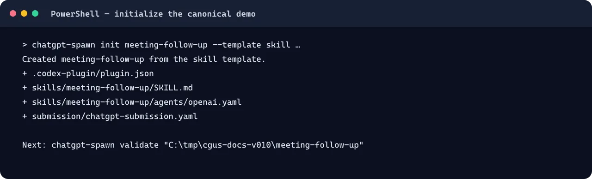

The image above came from the released CLI. Important commands remain selectable in this README.

<details>
<summary>Text transcript</summary>

```text
Created meeting-follow-up from the skill template.
  + .codex-plugin/plugin.json
  + skills/meeting-follow-up/SKILL.md
  + skills/meeting-follow-up/agents/openai.yaml
  + submission/chatgpt-submission.yaml

Next: chatgpt-spawn validate "C:\tmp\cgus-docs-v010\meeting-follow-up"
```

</details>

### 2. Understand the generated folder

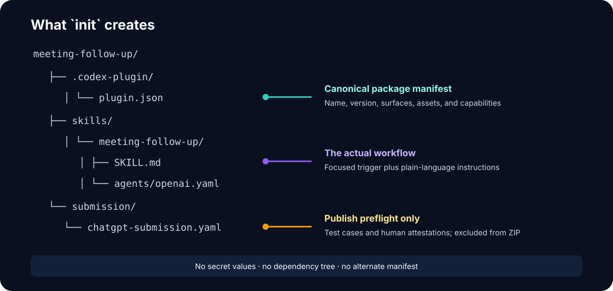

- `.codex-plugin/plugin.json` is the canonical manifest. There is no competing project manifest.
- `skills/<name>/SKILL.md` contains the focused trigger and workflow.
- `skills/<name>/agents/openai.yaml` supplies concise ChatGPT-facing presentation metadata.
- `submission/chatgpt-submission.yaml` contains publish tests and human attestations. It is preflight input and is excluded from the runtime ZIP.
- MCP templates also add `.mcp.json`; a real app link adds `.app.json` later.

### 3. Validate locally

Validation is offline unless you explicitly pass `--online`.

```powershell
node .\dist\cli.js validate .\meeting-follow-up --profile local
```

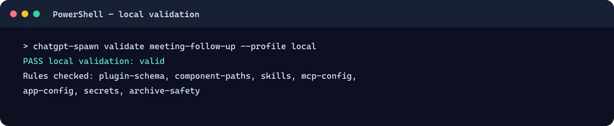

For automation, add `--json`. The exit codes are:

| Code | Meaning |
| ---: | --- |
| `0` | Validation or command succeeded. |
| `1` | Validation or runtime failure. |
| `2` | Automated publish checks passed, but human verification is still required. |

Validation errors tell you what is wrong, where it is, and how to fix it:

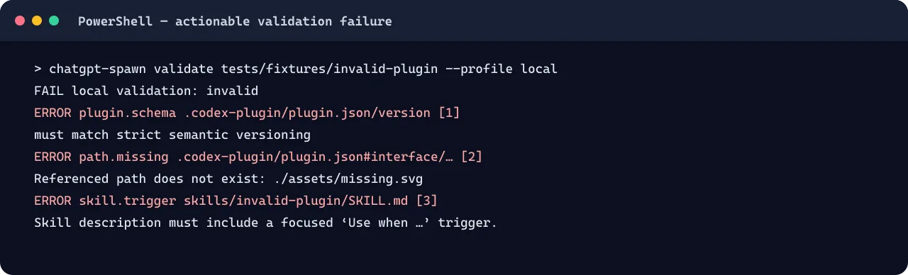

1. Use strict semantic versions such as `0.1.0`.
2. Keep referenced assets inside the plugin and make sure they exist.
3. Begin skill descriptions with a focused `Use when …` trigger.

<details>
<summary>Text transcript</summary>

```text
FAIL local validation: invalid
  ERROR plugin.schema  .codex-plugin/plugin.json/version
    must match the strict semantic-version pattern
  ERROR path.missing  .codex-plugin/plugin.json#interface/./assets/missing.svg
    Referenced path does not exist: ./assets/missing.svg
  ERROR skill.trigger  skills/invalid-plugin/SKILL.md
    Skill description must include a focused ‘Use when …’ trigger.
```

</details>

### 4. Build a deterministic ZIP

```powershell
node .\dist\cli.js build .\meeting-follow-up --out .\dist\meeting-follow-up.zip
```

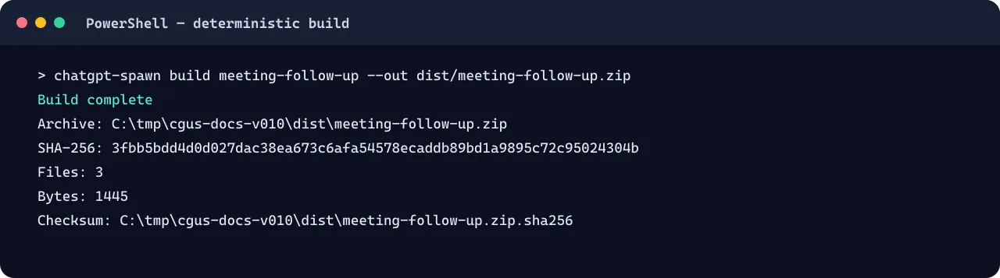

`build` validates first, sorts entries, fixes ZIP timestamps, excludes development and preflight content, rejects symbolic links, and writes `meeting-follow-up.zip.sha256`. Building unchanged content twice produces identical bytes and the same SHA-256.

<details>
<summary>Verified build transcript</summary>

```text
Build complete
  Archive:  C:\tmp\cgus-docs-v010\dist\meeting-follow-up.zip
  SHA-256:  3fbb5bdd4d0d027dac38ea673c6afa54578ecaddb89bd1a9895c72c95024304b
  Files:    3
  Bytes:    1445
  Checksum: C:\tmp\cgus-docs-v010\dist\meeting-follow-up.zip.sha256
```

</details>

### 5. Register and link an MCP app

Skip this step for a skills-only plugin. For an MCP App, register the public MCP endpoint in ChatGPT Apps Management and copy the real identifier supplied by ChatGPT. Never invent an ID.

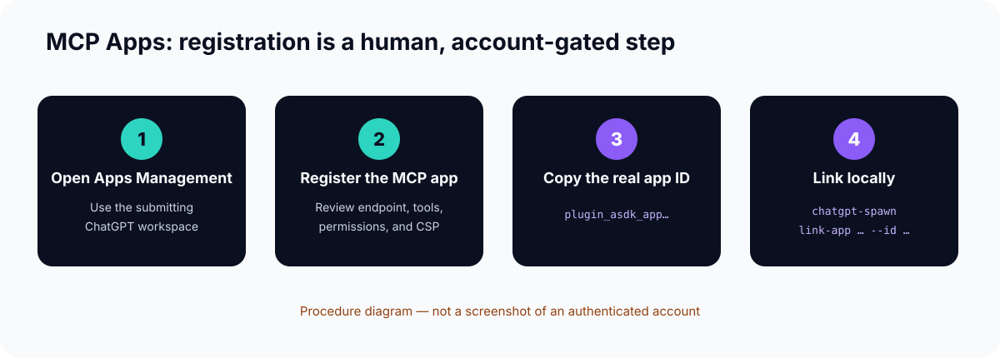

```powershell
node .\dist\cli.js link-app .\project-launch-planner --id plugin_asdk_app_your_real_id
```

This creates `.app.json` and adds `"apps": "./.app.json"` to the canonical manifest. Invalid or placeholder IDs fail before either file is changed.

> [!NOTE]
> This is intentionally a procedure diagram, not a fabricated authenticated screenshot. Apps Management is account-gated and its layout can change; use the current [OpenAI plugin documentation](https://developers.openai.com/plugins/build/plugins) as the source of truth.

### 6. Preview and install locally

Always run a dry run first:

```powershell
node .\dist\cli.js install .\meeting-follow-up --marketplace personal --dry-run
```

For a repository-local marketplace:

```powershell
node .\dist\cli.js install .\meeting-follow-up --marketplace repo --repo-root C:\path\to\your\repo --dry-run
```

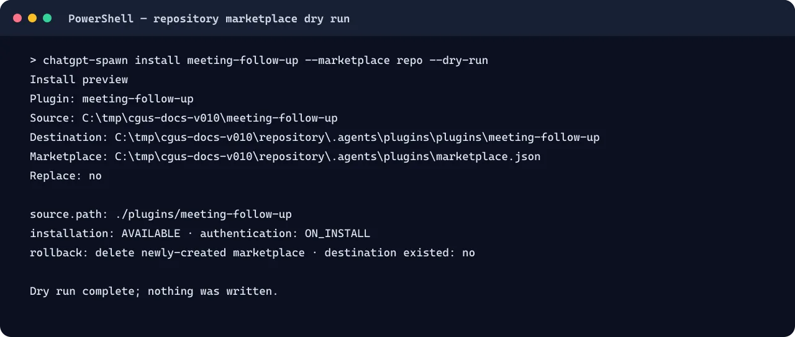

The preview shows the exact source, destination, marketplace file, entry, conflicts, replacement policy, and rollback data. `--dry-run` never writes. To apply an interactive plan, remove `--dry-run` and answer `y`. In CI, confirmation must be explicit:

```powershell
node .\dist\cli.js install .\meeting-follow-up --marketplace repo --repo-root C:\path\to\your\repo --yes
```

Use `--replace` only after reviewing a conflict. Existing destinations are never silently overwritten.

### 7. Open and verify the plugin

After the marketplace files are installed, use your client’s plugin control to add or refresh the entry. With the Codex CLI and the default personal marketplace:

```powershell
codex plugin add meeting-follow-up@personal
```

Open the plugin detail and verify the released identity and permissions—not only that a card exists:

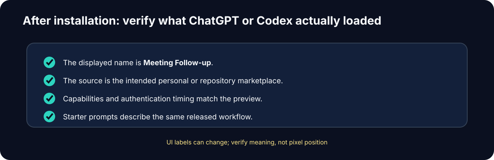

For repository marketplaces, add the marketplace root first if your client has not already configured it:

```powershell
codex plugin marketplace add C:\path\to\your\repo\.agents\plugins
codex plugin add meeting-follow-up@repo-local
```

### 8. Run the canonical smoke test

Use a tiny source that makes invention easy to detect:

```text
Decision: ship Friday. Alex owns release notes. Security follow-up has no owner.
```

Then ask:

```text
Use Meeting Follow-up to create a recap and action list.
```

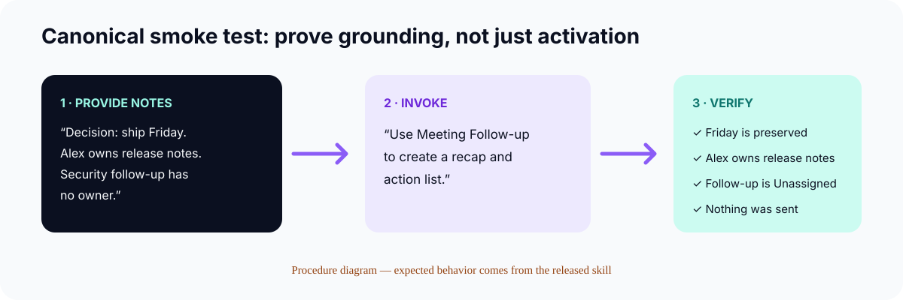

The result should preserve Friday and Alex, label the security action `Unassigned`, and send nothing. That tests the actual safety behavior rather than only checking that the plugin can be selected.

### 9. Run publish preflight

```powershell
node .\dist\cli.js validate .\meeting-follow-up --profile publish
```

Add `--online` only when you want the CLI to contact the declared public MCP endpoint and inspect `initialize` plus `tools/list`.

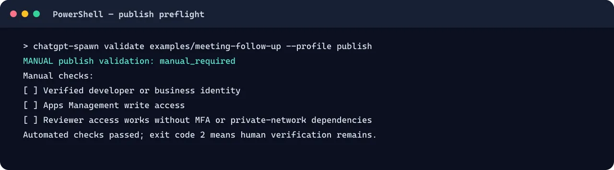

`manual_required` is a successful automated preflight with exit code `2`. It does not prove publisher identity, Apps Management access, or reviewer access. Set an attestation to `true` only after a person has verified it.

## Template comparison

| Template | Choose it when | Generated pieces | Credentials by default | Recommended first test |
| --- | --- | --- | --- | --- |
| `skill` | ChatGPT already has everything needed and needs a repeatable workflow. | Manifest, skill, agent metadata, submission preflight | None | `meeting-follow-up` |
| `mcp` | ChatGPT must call a local or remote tool. | Skill package plus `.mcp.json` and server guidance | None; secret names only if added | Inspect `tools/list` and negative inputs |
| `mcp-ui` | A callable tool also needs an interactive view. | MCP package plus UI starter | None | `project-launch-planner` with mock data |
| `custom-gpt-action` | You need files for the manual Custom GPT editor. | Plugin skill, export manifest, instructions, knowledge, OpenAPI action | None | Export and compare `SHA256SUMS` |

Start with `skill` unless a requirement clearly demands a new tool. Start with `mcp` unless an interactive interface materially helps users.

## Personal ChatGPT export

This is the default route for people without workspace administration, Apps Management, an app ID, an API key, or an MCP server:

```powershell
node .\dist\cli.js export personal-chat .\meeting-follow-up --out .\meeting-follow-up-chat
```

The output is deliberately small:

```text
meeting-follow-up-chat/
├── START-HERE.md
├── CHATGPT-PROMPT.md
└── SHA256SUMS
```

`CHATGPT-PROMPT.md` contains the validated skill instructions plus guardrails against claiming unavailable tools or asking for secrets. `START-HERE.md` explains exactly what to copy and includes the plugin's conversation starters. This export accepts skills-only plugins; it rejects MCP and MCP UI projects because a text prompt cannot honestly reproduce external tools.

OpenAI's current personalization documentation also describes [custom instructions](https://learn.chatgpt.com/docs/personalize#add-custom-instructions) for preferences that should carry across chats. Copying the prompt into a single conversation is the simplest route and avoids depending on account-specific instruction limits.

## Custom GPT export

Create and export a project:

```powershell
node .\dist\cli.js init .\catalog-lookup-action --template custom-gpt-action --name catalog-lookup-action --description "Export a catalog lookup action for the manual Custom GPT editor." --author "Your Name" --repository "https://github.com/your-name/catalog-lookup-action" --action-base-url "https://catalog-api.your-domain.com"
node .\dist\cli.js export custom-gpt .\catalog-lookup-action --out .\custom-gpt-export
```

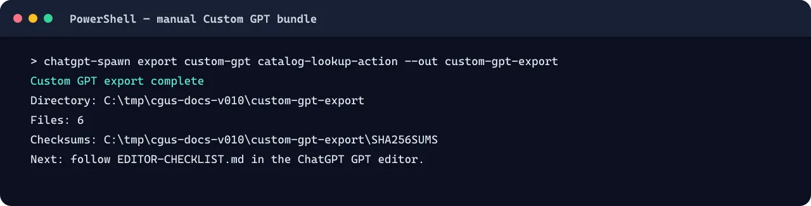

The bundle contains:

```text
custom-gpt-export/
├── instructions.md
├── conversation-starters.md
├── knowledge/
├── actions/
├── EDITOR-CHECKLIST.md
└── SHA256SUMS
```

Follow `EDITOR-CHECKLIST.md` in the ChatGPT GPT editor. The CLI does not create the GPT, change sharing settings, upload credentials, or publish it.

## Security and privacy

The validator enforces:

- Strict manifest fields, semantic versions, normalized names, HTTPS metadata, and starter-prompt limits.
- Contained `./` component and asset paths; traversal and missing files fail.
- Valid skill frontmatter, focused triggers, and no `[TODO: …]` markers.
- Structured `.mcp.json` and `.app.json`, with real `plugin_asdk_app…` IDs only.
- No symbolic links, external links, `.env` files, private-key containers, detected access tokens, debug payloads, `.git`, or `node_modules` in release archives.
- Publish metadata, exact CSP domains, tool schemas and safety annotations, five positive tests, and three negative tests.

Important limits:

- Static validation is not a sandbox and does not prove third-party code or endpoints are safe.
- The CLI never asks for secret values. If a tool needs authentication, document secret **names** and configure values through the approved runtime.
- Online validation contacts URLs only when you pass `--online` or `doctor --check-docs`.
- No command can guarantee a provider spending cap or marketplace acceptance.

See [`SECURITY.md`](./SECURITY.md) for private vulnerability reporting and [`PRIVACY.md`](./PRIVACY.md) for the network boundary.

## Public library API

```ts
import {
  applyInstall,
  buildPluginArchive,
  exportCustomGpt,
  exportPersonalChat,
  linkRegisteredApp,
  planInstall,
  scaffoldPlugin,
  validatePlugin,
} from "@agentmindcloud/chatgpt-spawn";
```

The package exports:

- `scaffoldPlugin(options): Promise<ScaffoldResult>`
- `validatePlugin(root, options): Promise<ValidationReport>`
- `buildPluginArchive(root, options): Promise<BuildResult>`
- `planInstall(root, options): Promise<InstallPlan>`
- `applyInstall(plan, { confirmed }): Promise<InstallResult>`
- `linkRegisteredApp(root, appId): Promise<LinkResult>`
- `exportPersonalChat(root, options): Promise<PersonalChatExportResult>`
- `exportCustomGpt(root, options): Promise<CustomGptExportResult>`

`InstallPlan` includes the exact source, destination, marketplace before/after state, conflicts, replacement flag, and rollback data so another interface can present the same confirmation boundary.

## Doctor

Run local checks:

```powershell
node .\dist\cli.js doctor .\meeting-follow-up
```

Check the locked first-party documentation URLs as an explicit network action:

```powershell
node .\dist\cli.js doctor .\meeting-follow-up --check-docs
```

The lock is [`compat/openai-docs.lock.json`](./compat/openai-docs.lock.json). CI checks drift weekly so changing OpenAI surfaces are reviewed rather than silently assumed.

## Troubleshooting

### I do not have a workspace, app ID, or API key

Use a skills-only template and run `export personal-chat`. Open `START-HERE.md` and paste `CHATGPT-PROMPT.md` into a normal ChatGPT conversation. Do not run `link-app` or install an MCP template.

### `Noninteractive init requires: --template, --name, --description, --author, --repository`

Your shell is not interactive and essential metadata is missing. Supply every listed option. The `mcp` and `mcp-ui` templates also require `--mcp-url`; `custom-gpt-action` requires `--action-base-url`. The CLI intentionally refuses to generate TODO or `example.com` placeholders.

### `Plugin folder must be named …`

The folder name must equal the normalized manifest `name`. Rename the folder or recreate it with matching `init <dir>` and `--name` values.

### `Path must stay inside the plugin root`

A manifest, action, or asset path contains traversal such as `../`. Move the file into the plugin folder and reference it with `./...`.

### `App ID must be a real ChatGPT Apps SDK identifier`

Register the MCP app in Apps Management first. Copy the returned `plugin_asdk_app…` value exactly; do not use an example ID.

### `Installation requires explicit confirmation`

Review the printed plan. Use the interactive `y` prompt, or pass `--yes` only in automation that has already reviewed the plan.

### `Installation has unresolved conflicts`

The marketplace entry or destination already exists. Inspect the conflict and rollback data, then use `--replace` only if overwriting is intentional.

### Publish validation exits with code `2`

This is `manual_required`, not an automated failure. Complete publisher identity, Apps Management permission, and reviewer-access checks, then update the attestations honestly.

### My remote MCP check fails

Confirm the URL is public HTTPS, supports the current MCP initialization flow, advertises at least one tool, and declares `inputSchema`, `readOnlyHint`, `destructiveHint`, and `openWorldHint`. Re-run with `--online` only after the endpoint is ready.

### Windows blocks a script or cannot find Node

Install Node.js 20 or newer, open a new PowerShell window, and confirm:

```powershell
node --version
npm --version
```

Use `node .\dist\cli.js` from a source checkout if global or `npx` command resolution is restricted.

## Repository map

```text
src/        TypeScript library and CLI
schemas/    Strict JSON Schemas
templates/  Four scaffold templates
plugin/     Self-hosting ChatGPT companion
examples/   Credential-free canonical demos
tests/      Golden, adversarial, deterministic, and end-to-end tests
docs/       Visual guides, provenance audit, and release documentation
assets/     Original brand family and social assets
compat/     Locked first-party OpenAI documentation references
```

## FAQ

**Do I need an MCP server?**

No. Most instruction-driven workflows should start with `skill`.

**Do I need a paid workspace, app ID, or API key?**

No for `export personal-chat`. Those are needed only for the separate features that actually register apps, expose MCP tools, or call authenticated services.

**Does this upload my plugin to OpenAI?**

No. Build and validation are local. App registration and publication are separate human actions.

**Does it publish a Custom GPT?**

No. It produces a byte-checked manual editor bundle because no documented creation API is assumed.

**Can another AI client use the output?**

Skills and MCP may be portable, but named non-OpenAI adapters are outside v1. ChatGPT is the product priority; Codex follows the shared plugin format.

**Can I commit `.env` or a private key if the repository is private?**

No. The validator rejects secret-bearing files. Configure values in the approved runtime and store only secret names in documentation.

**Why is build output so small?**

Release ZIPs intentionally exclude submission preflight, Custom GPT source bundles, `.git`, dependencies, coverage, and build artifacts.

## Brand, contribution, and support

The original “Portal + Conversation” identity uses deep navy `#0B1020`, electric teal `#2DD4BF`, violet `#8B5CF6`, and off-white `#F8FAFC`. Usage rules and the non-endorsement boundary are in [`assets/brand/README.md`](./assets/brand/README.md). Use the supplied mark; do not combine it with OpenAI branding.

- Read [`CONTRIBUTING.md`](./CONTRIBUTING.md) before opening a pull request.
- Review the [`0.1.0 changelog`](./CHANGELOG.md).
- Report bugs through [GitHub Issues](https://github.com/AgentMindCloud/ChatGPT_Universal_Spawn/issues).
- Report vulnerabilities privately through [GitHub Security Advisories](https://github.com/AgentMindCloud/ChatGPT_Universal_Spawn/security/advisories/new).
- Read the [upstream audit](./docs/upstream-audit.md) and [`NOTICE`](./NOTICE) for provenance.

## License and attribution

Licensed under [Apache-2.0](./LICENSE). The analyzed upstream archive, commit, retained principles, replaced components, and removed catalog are documented in [`NOTICE`](./NOTICE) and [`docs/upstream-audit.md`](./docs/upstream-audit.md).

ChatGPT and OpenAI are trademarks of OpenAI. Their names are used only to describe compatibility and documentation sources.
